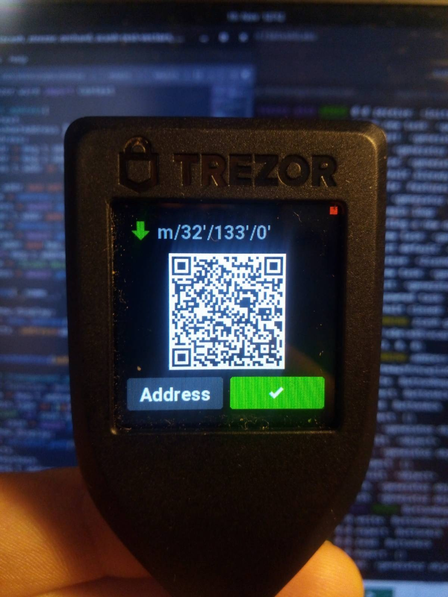

# M.2 Summary

We are glad to announce the submission of milestone M.2. New features are

- Derivation of spending keys according to the ZIP-32
- Orchard shielded addresses
- Unified Addresses according to the ZIP-316
- Get an address and viewing keys via `trezorctl` command
- Review an address on display (text or QR code)

We move to the 3rd and the most complex stage of the firmware development - transaction signing.

# M.2 Detailed



_shielded address on real device :tada:_

You can check the [code](https://github.com/jarys/trezor-firmware/tree/zcash) and the [PR](https://github.com/trezor/trezor-firmware/pull/1847).

### `trezorctl` and `trezorlib` API

You can get address via `trezorctl` command

```
$ trezorctl zcash get-address --help
Usage: trezorctl zcash get-address [OPTIONS]

  Example:

  trezorctl zcash get-address -d -t m/44h/133h/0h/0/0 -z m/32h/133h/0h -j 0

Options:
  -t, --t-address TEXT             BIP-32 path of a P2PKH transparent address.
  -z, --z-address TEXT             ZIP-32 path of an Orchard shielded address.
  -j, --diversifier-index INTEGER  diversifier index of the shielded address.
  -d, --show-display
  --help                           Show this message and exit.
```

You can get raw Full Viewing Key and raw Incoming Viewing Key by these commands:

```bash
trezorctl zcash get-fvk -z m/32h/133h/0h
trezorctl zcash get-ivk -z m/32h/133h/0h
```

These functionalities can be also used via python by importing
```python
from trezorlib.zcash import get_address, get_fvk, get_ivk
```

Trezor Connect integration will be added as part of M.3. with `sign_tx` functionality.

### Show Address Layouts


### Export Full Viewing Key layout


