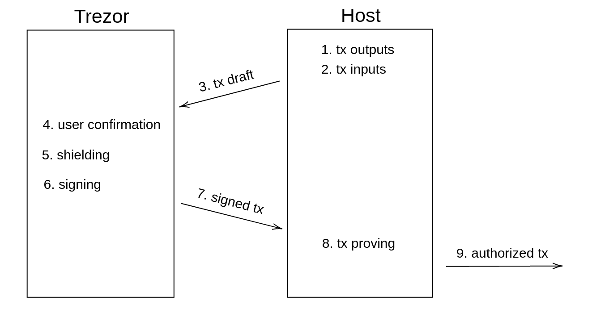

# Trezor support for Zcash shielded transaction  
  
## Introduction  
  
The goal of this document is to explain, how Zcash Orchard shielded transactions are implemented in Trezor.

## Notation

I use `inline code font` for names of types and variables. I write `type[n]` for array of type `type` and length `n`. I write only `type[]`, if the length of the array is obvious from the context.

I write python-styled pseudocode for ilustrative purposes. Note that `+` is byte array concatenation and `x*G` is scalar multiplication on the curve.

## Structure of this document

TODO: roll out sections, protocol links, security model etc.

Sections from [Shielded transactions](#shielded-transactions) to [Blockchain scanning](#blockchain-scanning) are high level overview of Zcash technology and terminology.

Section [Transaction flow](#transaction-flow) describes sending shielded transaction from a Trezor.

Section [Detailed protocol](#detailed-protocol) is a result of an efford to describe the previous protocol more explicitly.

Sections [Transaction fileds](#transaction-fields) and [Action description fields](#action-description-fields) describes transaction fields and they are copy-pasted from the Zcash documentation.
  
## Shielded transactions  
  
Zcash is designed as an extension of bitcoin, however it is an independent cryptocurrency. It enables to hide a transaction graph to enhance user's privacy.  
  
There two types of Zcash addresses: _transparent_ and _shielded_. Transparent addresses are equivalent to Bitcoin addresses. For a shielded address, nobody (except its owner) can see the address balance, incoming and outcoming payments. These two types of addresses are compatible, hence it is posible to send shielded funds to a transparent address and vice versa. It is also possible to send fully shielded transaction from one shielded address to another, as ilustrated bellow.  
  
  

_image source: `https://www.veradiverdict.com/p/snapchat-for-payments`_  
  
In fact, a transaction can be even more mixed, having multiple transparent inputs and outputs and multiple shielded inputs and outputs, as ilustrated bellow.  
  
  
  
Transaction creator proves the integrity of the shielded transaction (tx balance, spend authorization, no double spending...) by attaching a zero knowledge proof.  
  
There are three consecutive vesions of Zcash shielded protocol: Sprouts, Sapling and Orchard.  
  
- Sprouts (2016) is the first naive clumpsy implementation of shielded transactions.  
  
- Sapling (2018) integrated many circuit optimizations using algebraic hash functions over JubJub curve. Futher it brought major restructuralizations of key components and shielded data.
  
- Orchard (2021) introduced more efficient Halo 2 zk-proving protocol and several additional circuit and structural changes.  


_transaction structure for different shielded protocols_

Each of these protocols has its own privacy pool, e.i. privacy set of all funds currently shielded by the protocol. The more funds were shielded by the protocol, the higher level of privacy pool reaches.  
  
Since Sprouts deprication is scheduled (2021), users are forced to migrate their shielded funds into Sapling pool. Othewise they will loose them irrevocably.

Multiple shielded protocols can be used within one transaction as ilustrated bellow.

 

Through this document, I consider a transaction that contains only transparent inputs and outputs and Orchard shielded inputs and outputs. Hence I minimize usage of _Orchard_ prefix. For example by _binding signature_ I mean _Orchard binding signature_, not _Sapling binding signature_.
  
## Security model

  
  
Our communication scheme consists of four players. User, Trezor, a Host (typically a PC or a cell phone) and Zcash fullnode (a server maintaining a full blockchain copy).  
  
Our security goals differs according to following two scenarios:  
  
1. Even if the **Host is malicious**, he cannot spend Zcash funds from the Trezor. However, he can violate Zcash privacy features.  
  
2. If the **Host is honest**, then all Zcash privacy features are preserved.

Zcash privacy guarantees are for example: 
  
- **Address unlinkability:** Given two shielded addresses, nobody can decide whether they belong to the same spending authority.  
  
- **Transaction graph shieldeing:** Given a shielded input and a copy of the blockchain, nobody can decide to which previously commited shielded outputs this input coresponds to.  
  
- **Amount privacy:** Given an shielded input (resp. output), nobody can compute, how many ZECs was spent (resp. sent).  


## Pallas and Vesta curves

Orchard uses pair of curve _Pasta_ and _Vesta_ for EC cryptography. These Weiestrass curves defined by equation

```
y^2 = x^3 + 5
```

and two constants:

```python
q = 0x40000000000000000000000000000000224698fc094cf91b992d30ed00000001
r = 0x40000000000000000000000000000000224698fc0994a8dd8c46eb2100000001
```

`q` is the size of base field of Pallas and scalar field of Vesta. `r` is the size of base field of Vesta and scalar field of Pallas.

These two curves were designed by Zcash cryptographers. They are documented on [github](https://github.com/zcash/pasta). All Orchard's cryptography runs over the Pallas curve. Vesta is used only during a proof computation.

## ZIP32  
  
Paths of Orchard keys are of type  
  
```  
m_orchard/purpose'/coin_type'/account'  
```  
  
where  
  
- `purpose` is set to `32'` following the BIP 43 recommendation.  
- `coin_type` is set to `133'` following the SLIP 44 recomendation.  
- `account` is numbered from index 0 in sequentially increasing manner.  
  
Additionally, every account has 2^88 available diversified payment addresses belonging to the same spending authority. _Default payment address_ is indexed by 0.  

_A change address_ is an address where a payer returns the rest of his unspent inputs. Since shielded addresses are not recorded to the blockchain (directly), we can fix one change address without loosing privacy. We set the default address to be the change address.   
  
For a `secret` seed, Orchard master key and master chaincode is generated as follows.  
  
```python 
I = Blake2b_512(b"ZcashIP32Orchard", secret)  
sk_m, c_m = I[:32],I[32:]   
```  
  
Given a pair of secret key `sk` and a chain code `c`, `i`-th Orchard child key is generated as follows:  
  
```python  
if i < 2**31:  
	raise ValueError("All Orcarhd secret keys must be hardened.")  
I = Blake2b_512(b"Zcash_ExpandSeed", c + [0x81] + sk + i.to_bytes())  
sk_i, c_i = I[:32],I[32:]   
```  
  
## Key components  
  
_Spending key_ `sk` is used as a seed for generating Orchad key components. Components are derived hiearchically as ilustrated bellow.  

  
  
Here is the table of key components with detailed names and comments.  

| Symbol | Name                          | Comment |  
|--------|-------------------------------|--------------------------------------------------|  
| `ask`  | spend authorizing key         | Enables to spend funds from the address. Never leaves the Trezor.  |  
| `ak`   | spend validating key          | public key for `ask`  |  
| `nk`   | nullifier deriving key        | |  
| `rivk` |                               | some between-product randomness |  
| `fvk`  | full viewing key              | is the triple `(ak,nk,rivk)` | Enables to prove transaction corectness and to derive other keys. Leaves the Trezor.  |  
| `ivk`  | incoming viewing key          | Enables to detect and decrypt all incoming Notes.  |  
| `ovk`  | outgoing viewing key          | Enables to decrypt Notes sent from this account. This feature is optional. Every time a Note is sent from this, user decides whether it will be backwards decryptable.  |  
| `dk`   | diversifier deriving key      | Enables do derive diversifiers.  |  
| `d`    | address diversifier           | |  
| `pk_d` | diversified transmission key  | |  
| `addr` | divesified payment address    | is the pair `(d,pk_d)`  |  
  

Here is the ilustrative pseudocode for key components derivation. See Zcash's documentation for details. `sinsemilla_commit` and `hash_to_Pallas_point` are complex functions based on algebraic hash functions and elliptic curves isogenies. `r` is the Pallas scalar field and `q` is the Pallas base field. 

```python  
# + is concatenation  
def PRF(sk, m):  
	return Blake2b_512(b"Zcash_ExpandSeed", sk + m)  
  
ask  = PRF(sk, [0x06]) mod r  
  
ak   = ask*G # G is the Pallas generator  
nk   = PRF(sk, [0x07]) mod q  
rivk = PRF(sk, [0x08]) mod r  
  
fvk = (ak,nk,rivk)  
  
ivk  = sinsemilla_commit(rivk, ak, nk)  
  
I    = PRF(rivk, [0x82] + ak + nk)   
dk   = I[:32]  
ovk  = I[32:]  
  
  
def gen_diversified_address(j, dk, ivk):  
	j_bytes = int_to_bytes(j, byte_length=11, signed=False)  
	d = FF1_AES_256.encrypt(dk_i, b"", j_bytes)  
	G_d = hash_to_Pallas_point(d)  
	pk_d = ivk*G_d  
	return (d,pk_d)  
```   

  

## Unified addresses

TODO: uaddr QR code image

Unified addresses are one of NU5 features. They enable a user to share his transaparent and shielded payment addresses in one standardized bundle. UAs are well described in [ZIP 316](https://github.com/zcash/zips/blob/main/zip-0316.rst).

Although UAs are not indispensable feature, we want to support them and they are part of the grant description.

> We'd also be up for strong marketing in support of Trezor supporting Unified Addresses out of the gate.

_source: @Josh, 13.5.2021, #ecc-trezor slack channel_

In a shortcut:

```
ua_bytes = address_1 || ... || address_n
address = typecode || length || key
length = uint8
typecode = 0x01 # for transparent
           0x02 # for Sapling
           0x03 # for Orchard 

padding = [0x00]*16 # 16 zero bytes
ua_encoded = F4Jumble(ua_bytes || padding)
unified_address = "u" || Bech32m(ua_encoded)
```

where `F4Jumble` is an unkeyed 4-round Feistel construction to approximate a random permutation described in [ZIP 316](https://github.com/zcash/zips/blob/main/zip-0316.rst). This function make it computationally impossible to generate two lexicographicly close addresses. Therefore it should be sufficient to check only first 16 bytes when spending to UA (**not confirmed, just my reasoning**).
  
## Sending (output) Notes  

In Zcash terminology, user sends and recieves _Notes_. To send a Note, user chooses Note's value `v`, Note's receiver address `addr` and (an optional) Note's arbitrary comment `memo`.  
  
To create and send a new Note, user shields the Note, using a randomness `rseed` and `rcv`, getting a tuple (`cm`, `cv`, `C_enc`, `C_out`, `epk`). This tuple is recorded to blockchain.  
  
- `cm` - Note commitment  
- `cv` - value commitement  
- `C_enc` - Note encryption for a recipient  
- `C_out` - Note encryption for a sender (optional)  
- `epk` - ephemeral key for a Diffie-Helman key exchange  

All these components must be computed in Trezor. It is the simplier way how Trezor can validate integrity and randomizations of these components.

## Spending (input) Notes  

When user is spending a Note, the only information related to the Note he must reveal within a shielded transaction is the Note's _nullifier_ `nf_new`, computed from the input Note's data `(cm, rseed, nf_old)` and user's nullifier key `nk`.
  
Nullifier serves as the serial number of a Note. Once the nullifier is reveiled within a valid transaction, Note is spent and any another transaction attempting to spend with the same nullifier will be refused.

Without knowledge of nullifier key `nk`, nullifier is not linkable to its Note. Hence nobody (including a Note sender), given a nullifier, can distinguish, which Note was spent.  

Next, a random Pallas scalar `alpha` is generated (in the Trezor). `alpha` is then used to randomize spend validating key `ak`. This randomized spend validating key (called `rk`) is part of an _Action_ description.

```python
rk = alpha*G + ak
``` 

`alpha` should be generated in Trezor. Othewise we cannot guarantee privacy features.

`rk` and `nf` could be computed by the Host.

On the otherside, computing `nf` and `rk` in the Trezor raises the implementation security and it simplifies the protocol. Hence we will compute the nullifier in the Trezor, if no fundamental barier appears.

[](If the `nf` was not computed in the Trezor, its integrity cannot be checked. Therefore user cannot control which of his Notes was spent. But since `cv` and `cm` were computed in the Trezor, user controls the value of the input Note of an Action. If a nullifier of a Note with a different value was sent by the Host, then the zk-proof must be invalid. (`cm` binds the Action to output `v_new` ZEC and `cv` binds the Action to add exactly `v_old - v_new` ZEC to a shielded transaction pool. Though `cm` and `cv` together bind the Action to has `c_old` ZEC on input). To sum it up, once the `cv` and `cm` were computed in the Trezor, then the only new freedom of the Host, who controls the nullifier, is to choose, which of user's Notes with value exactly `v_old` ZEC is spent as an Action input. Since the transaction inputs were selected by the Host anyway, the Host has this freedom anyway.)

## Orchard Actions  


  
Before sending a shielded Orchard transaction, a sender must pair input Notes with output Notes. Such a pair is called an _Action_.  
  
Both, set of input Notes and set output Notes, can be padded by _Dummy Notes_, to make these sets equal in size. A Dummy Note is a Note with zero value, no recepient and no connection to previously commited Notes. However Dummy Note is completely undistiquishable from other Notes after the shielding procedure.  

> In order to minimize information leakage, the sender SHOULD randomize the order of Action descriptions in a transaction. Other considerations relating to information leakage from the structure of transactions are beyond the scope of this specification.

_source: NU5 doc § 4.7.3_
  
## Transaction authorization  
  
Shielded part of a transaction is authorized by  
  
1. `spendAuthSig[]` - _spend authorization signatures_  
2. `bindingSig` - _binding signature_  
3. `proof` - zero-knowledge proof of the transaction integrity  
  
### Spend authorization signatures  
  
For each input Note, rerandomized spend validating key `ak` (called `rk`) is a part of an Action description. A signature `spendAuthSig` of transaction's `SIGHASH` made by coresponding randomized spend authorizing key `ask` is computed to authorize a spend. Since `ask` never leaves the Trezor, user's ZEC funds cannot be spent without confirmation on Trezor.  
  
### Binding signature  
  
Binding signature proofs the balance of the shielded part of a transaction (i.e. all shielded inputs minus all shielded outputs = `v_net`). It uses homomorphic additivity of Pederson's commitments used for value commitments `cv[]`. The same technique is used in Monero. 
  
### Proof  
  
Integrity of a shielded transaction is proven by zk-SNARK (zero-knowledge Succint Non-interactive ARgument of Knowledge). Zcash Orchard uses proof system called _Halo 2_. Since the proof generation is computationally demanding, it is delegated to the Host.  
  
Prover needs mekle tree paths of Notes spent by transaction to prove: "This Note is commited somewhere in the blockchain.". A root `rt` of mekle tree of every Note commitment in the blockchain is fixed and attached to a transaction as a reference for this statement. The root can be computed from any previous state of the blockchain. However, the fresher root taken, the bigger is the privacy set.  
  
**Since the proof is not a part of transaction signed fields, Trezor has no control over the proof randomness.** It follows that the Host can manipulate randomness of the proof arbitrarily, for example to encode some information into the proof. In our model, a mallicious Host can violate all privacy features of the protocol. Nevertheless, this vulnarability enables the Host to leak information directly through the main channel (e.i. by recording a transaction with a rigged proof onto blockchain), instead of comunicating data thought a side channel.

We don't consider this issue to be important. Backward proof randomness checking could be implemented to detect such Host's mal-behaviour, but it would be technically demanding and it would require circuite modifications.
  
## Blockchain scanning  
  
To detect incoming Notes, a Host must try to decrypt every new shielded Note in the blockchain using incoming viewing key `ivk`. Notes are encrypted by `AEAD_CHACHA20_POLY1305`, which returns integrity error for inappropriate keys. You can find ilustrative python pseudocode bellow.   
  
```python  
def get_incoming_notes(ivk, block):  
	for (C_enc, epk) in block:  
		shared_key = Pallas.multiply(scalar=ivk, point=epk)  
		KDF_input  = shared_key + epk # + is concatenation  
		symetric_key = Blake2b_256("Zcash_OrchardKDF", KDF_input)  
		try:  
			yield AEAD_CHACHA20_POLY1305(symetric_key).decrypt(C_enc)  
		except CiphertextIntegrityError:  
			continue  
```  
  
Futher, all detected incoming Notes and their merkle tree paths must be stored in the Host. Querying some blocks more than others could reveal information about user's transactions to the fullnode.  
  
## Simplified protocol

TODO: update image



1. User specifies transaction outputs.  
2. Host selects appropriate inputs from his database and he sets a trasaction fee. 
3. Host and Trezor comunicate transparent inputs and outputs as in bitcoin.
4. for every Action
	- Host send Action plain data
	- Trezor let user to verify output data on the screen
	- Trezor shields Action
	- Trezor sends back Action shielded data and used randomizers
5. Trezor authorizes transaction by spend authorizing signatures and a binding signature.  
6. Host computes zk-proof of transaction integrity.  
7. Host sends transaction to a full node.

TODO: Have signatures to be streamed?

## OUTDATED: Detailed protocol

Structs: 
```  
fvk  = (ak, nk, rivk)  
addr = (d,pk_d)  
input_note_plain = (addr,v,cm,nf_old)  
output_note_plain = (addr,v,memo,ovk_flag)  
action_plain = (input_note_plain, output_note_plain)  
action_shielded = (rk, nf_new, cv, cm*, epk, C_enc, C_out)   
randomizers = (alpha,rcv,rseed)
``` 

Detailed protocol:  
1. User enters transparent outputs.
2. User enters output Notes `output_note_plain[]`.  
3. Host finds appropriate transaction input Notes `input_note_plain[]` in his database.
4. Host sets transaction fee. (0.00001 ZEC is a default fee.)  
5. If sets of input Notes and output Notes have not equal size, Host pads smaller set with Dummy Notes.  
6. Host pairs input Notes with output Notes into Actions.
7. Host randomize inputs order, outputs order and Actions order.  
8. Host sends transaction header.
9. Host and Trezor comunicate transparent inputs and outputs as in bitcoin.
10. Trezor sets `v_net = 0`.
11. Trezor initialize `SIGHASH` computation.
12. for every Action:
	- Host sends Action (`action_plain`) into Trezor.
	- if output note is not Dummy, Trezor let user to verify
		- Note's receiver address `addr`  
		- Note's value `v`  
		- Note's `memo` ("None" in case of empty memo)  
		- Note's `ovk_flag`  
	- Trezor updates `v_net += v_old - v_new`
	- Trezor generates a random 32 byte sequence  `rseed` 
	- Trezor generates a random Pallas scalars `alpha` and `rcv`     
	- Trezor computes Action shielding using `rseed` and `rcv`
	- if `ovk_flag` is set to 1
		- then `C_out` is encryption of `(pk_d,esk)` 
		- else `C_out` is encryption of random data by a random key
	- Trezor computes input Note nullifier `nf_new` using `nk`
	- Trezor computes randomized spend validating key `rk` using `alpha` and `ak`. 
	- Trezor updates `SIGHASH`.
	- Trezor responds to Host with Action description (`action_shielded`) and `randomizers`.
13. Host requests transaction authorization.
	- Trezor authorizes the transaction by signatures for transaparent inputs `tSig[]`.  
	- Trezor authorizes the transaction by spend authorizing signatures `spendAuthSig[]`.  
	- Trezor authorizes the transaction by binding signature `bindingSig`. 
	- Trezor responds by `(tSig[],spendAuthSig[],bindingSig)`.

14. Host requests `fvk`.
15. (Optionally) Host requests randomness for proof generation.
	- Trezor responds by 9 Pallas scalars. 
16. Host authorizes the transaction by zk-`proof`.  
17. Host sends the authorized transaction to a full node.  

## Delayed shielding

If the Action shielding will be slow, then we can delay the shielding as follows:

Phase 1: Host streams Actions. User confirms outputs on the screen. Trezor computes only hash of streamed data sequentially. 

Phase 2: Host restreams all Actions. Trezor shields Actions without user's confirmation and it computes a hash of streamed data sequentially.

In the end, Trezor checks that the hash from the Phase 1 equals to the hash from the Phase 2. 

This method will increase the complexity of the communication protocol, but user wont have to wait between confirmations of individual shielded outputs.   
  
## Transaction fields 

source: [ZIP 225](https://zips.z.cash/zip-0225) 
  
| Bytes | Name | Data Type | Description|  
|---|-----------------|--------|--------------------------------------------------------------|  
| 4 | `header`          | uint32 |                                                              |  
| 4 | `nVersionGroupId` | uint32 | Version group ID (nonzero).                                  |  
| 4 | `nConsensusBranchId` | uint32 | Consensus branch ID (nonzero). |  
| 4 | `lock_time`       | uint32 | Unix-epoch UTC time or block height, encoded as in Bitcoin.  |  
| 4 | `nExpiryHeight`   | uint32 | A block height in the range (1...499999999) after which the transaction will expire, or 0 to disable expiry. [ZIP-203] |  
|   |                   |        |                                                              |  
| varies | `tx_in_count`  | compactSize | Number of transparent inputs.               |  
| varies | `tx_in`        | tx_in       | Transparent inputs, encoded as in Bitcoin.  |  
| varies | `tx_out_count` | compactSize | Number of transparent outputs.              |  
| varies | `tx_out`       | tx_out      | Transparent outputs, encoded as in Bitcoin. |  
|        |                |             |                                             |  
| 1   | `nSpendsSapling`  | compactSize | The number of Sapling Spend descriptions.  |  
| 1   | `nOutputsSapling` | compactSize | The number of Sapling Output descriptions. |  
| ... | ...               | ...         | Sapling staff skipped.             |   
|     |                   |             |                                    |  
| varies                | `nActionsOrchard`       | compactSize               | The number of Action descriptions `n`.  |  
| 884·`n`               | `vActionsOrchard`       | ActionDescription[`n`]     | A sequence of Action descriptions, as described bellow. |  
| 1                     | `flagsOrchard`          | byte                      | Orchard flags described bellow.   |  
| 8                     | `valueBalanceOrchard`   | int64                     | The net value of Orchard spends minus outputs.  |  
| 32                    | `anchorOrchard`         | byte[32]                  | A root of the Orchard note commitment tree at some block height in the past.  |  
| varies                | `sizeProofsOrchard`     | compactSize               | The length of the aggregated  zk-SNARK proof. |   
| `sizeProofsOrchard`   | `proofsOrchard`         | byte[`sizeProofsOrchard`]   | The aggregated zk-SNARK proof. |  
|64·`n`                 | `vSpendAuthSigsOrchard` | byte[64][`n`]             | Authorizing signatures for each spend of an Orchard Action description.  |  
|64                     | `bindingSigOrchard`     | byte[64]                  | An Orchard binding signature on the SIGHASH transaction hash. |  
  
   
Flags:  
- `enableSpendsOrchard` flag (bit 0)  
- `enableOutputsOrchard` flag (bit 1)
- Reserved, zeros (bits 2 .. 7)  

We set `nSpendsSapling` and `nOutputsSapling` to 0.

We set `enableSpendsOrchard` and `enableOutputsOrchard` to 1.
  
## Action description fields  

source: [ZIP 225](https://zips.z.cash/zip-0225)  
  
|  Bytes | Name            | Description |  
|--------|-----------------|-------------|  
|    32  | `cv`            | A value commitment to the net value of the input note minus the output note. |  
|    32  | `nullifier `    | The nullifier of the input note `nf`. |  
|    32  | `rk `           | The randomized validating key for `spendAuthSig`. |  
|    32  | `cmx  `         | The x-coordinate of the note commitment for the output note. |  
|    32  | `ephemeralKey`  | Encoding of an ephemeral Pallas public key `epk`. |  
|    580 | `encCiphertext` | A ciphertext component for the encrypted output note `C_enc` |  
|    80  | `outCiphertext` | A ciphertext component `C_out`, that enables the sender to recover receiver's payment address and note plaintext.|  
  

## Comparison with the Ledger

- We have no control over the proof randomness. (Ledger maybe wont too after the NU5.)
- We don't have to worry about memory optimalizations so much.

## Data flow


[](
Functionalities:

| Name                    | Input                                      | Output                           |  
|-------------------------|--------------------------------------------|----------------------------------|    
| ZIP32 keygen            | `secret`, `i`                              | `sk`                             |  
| Key components gen      | `sk`                                       | `ask`, `fvk`, `ivk`, `ovk`, `dk` |  
| Address diversifier     | `dk`, `ivk`, `index`                       | `addr`                           |  
| Action shielder         | `action_plain`, `rseed`,`aplha`,`rcv`      | `action_shielded`                |  
| Note decryption via ivk | `ivk`, `epk`, `C_enc`                      | `note_plain` or failture         |  
| Note decryption via ovk | `ovk`, `epk`, `C_out`, `C_enc`, `cm`, `cv` | `note_plain`                     |
| Nullifier gen           | `nk`, `rseed`, `cm`, `nf_old`              | `nf_new`                         |  
| Spend signer            | `SIGHASH`, `ask`, `alpha`                  | `spendAuthSig`                   |  
| Binding signer          | `SIGHASH`, `rcv[]`, `cv_net`               | `bindingSig`                     |  
| Prover                  | `action_plain[]`, `action_shielded[]`, `fvk`, `alpha[]`, `rcv[]`, `rssed[]`, `cv_net`  | `proof` |
[]()

## Trezor implementation

Zcash libraries are now available in Rust. I would like to use them directly as dependencies. It will be necesarry to make them `![no_std]` compatible. I'm actively working on that.

#### [librustzcash](https://github.com/zcash/librustzcash)

We need only f4jumble components, which I have already [rewrote]() into no_std.

#### [orchard](https://github.com/zcash/orchard)

Almost whole crate will be rewritten into no_std. You can check my proposal and progress [here]().

#### [pasta_curves](https://github.com/zcash/pasta_curves)

Crate is no_std.

#### [reddsa]()

no data

#### poseidon

will be no_std

## Suite implementation

[lightwalletd](https://github.com/zcash/lightwalletd) (coded in Go lang) can be used for communication with a full node.

[halo2](https://github.com/zcash/halo2) crate (coded in Rust) will be used for proof computation.
