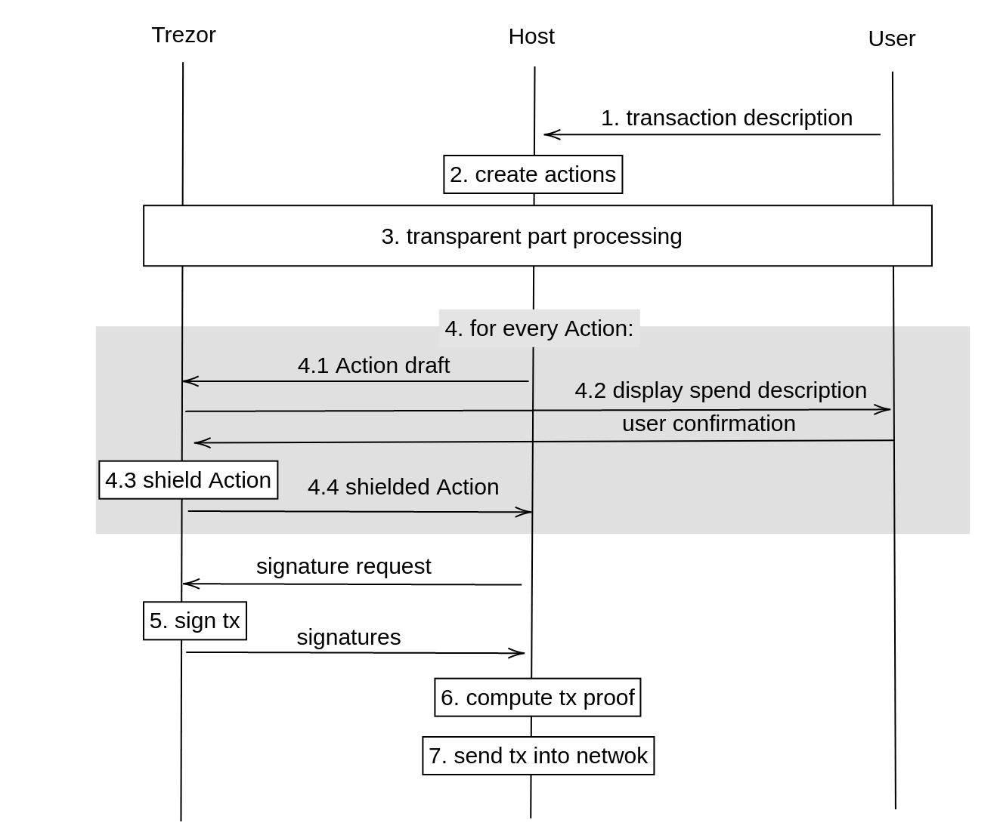

## Simplified protocol (outdated)



1. User specifies transaction outputs.  
2. Host selects appropriate inputs from his database and he sets a transaction fee.
3. Host and Trezor communicate transparent inputs and outputs as in bitcoin.
4. for every Action
    - 4.1. Host send Action plain data
    - 4.2. Trezor let user to verify output data on the screen
    - 4.3. Trezor shields Action
    - 4.4. Trezor sends back Action shielded data and used randomizers
5. Trezor authorizes transactions by authorizing signatures and a binding signature.  
6. Host computes zk-proof of transaction integrity.  
7. Host sends the transaction into network.

TODO: Have signatures to be streamed?

## Detailed protocol (outdated)

Structs:
```  
fvk  = (ak, nk, rivk)  
addr = (d,pk_d)  
input_note_plain = (addr,v,cm,nf_old)  
output_note_plain = (addr,v,memo,enable_C_out)  
action_plain = (input_note_plain, output_note_plain)  
action_shielded = (rk, nf_new, cv, cm*, epk, C_enc, C_out)   
randomizers = (alpha,rcv,rseed)
```

Detailed protocol:  
1. User enters transparent outputs.
2. User enters output Notes `output_note_plain[]`.  
3. Host finds appropriate transaction input Notes `input_note_plain[]` in his database.
4. Host sets a transaction fee. (0.00001 ZEC is a default fee.)  
5. If sets of input Notes and output Notes have not equal size, Host pads smaller set with Dummy Notes.  
6. Host pairs input Notes with output Notes into Actions.
7. Host randomize inputs order, outputs order and Actions order.  
8. Host sends transaction header.
9. Host and Trezor communicate transparent inputs and outputs as in bitcoin.
10. Trezor sets `v_net = 0`.
11. Trezor initializes `SIGHASH` computation.
12. for every Action:
    - Host sends Action (`action_plain`) into Trezor.
    - if output note is not Dummy, Trezor let user to verify
        - Note's receiver address `addr`  
        - Note's value `v`  
        - Note's `memo` ("None" in case of empty memo)  
        - Note's `enable_C_out`  
    - Trezor updates `v_net += v_old - v_new`
    - Trezor generates a random 32 byte sequence  `rseed`
    - Trezor generates a random Pallas scalars `alpha` and `rcv`     
    - Trezor computes Action shielding using `rseed` and `rcv`
    - if `enable_C_out` is set to 1
        - then `C_out` is encryption of `(pk_d,esk)`
        - else `C_out` is encryption of random data by a random key
    - Trezor computes input Note nullifier `nf_new` using `nk`
    - Trezor computes randomized spend validating key `rk` using `alpha` and `ak`.
    - Trezor updates `SIGHASH`.
    - Trezor responds to Host with Action description (`action_shielded`) and `randomizers`.
13. Host requests transaction authorization.
    - Trezor authorizes the transaction by signatures for transparent inputs `tSig[]`.  
    - Trezor authorizes the transaction by spend authorizing signatures `spendAuthSig[]`.  
    - Trezor authorizes the transaction by binding signature `bindingSig`.
    - Trezor responds by `(tSig[],spendAuthSig[],bindingSig)`.
14. Host requests `fvk`.
15. (Optionally) Host requests randomness for proof generation.
    - Trezor responds with 9 Pallas scalars.
16. Host authorizes the transaction by zk-`proof`.  
17. Host sends the authorized transaction to a full node.   
