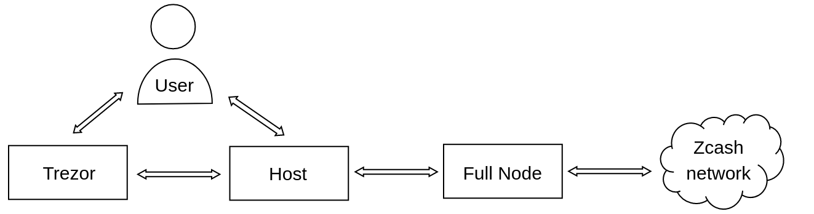
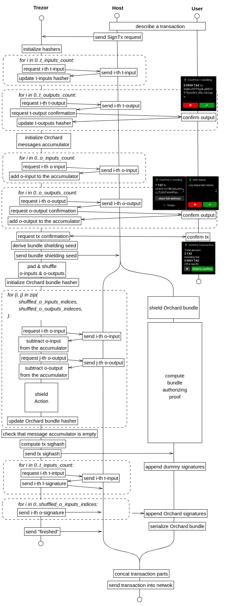
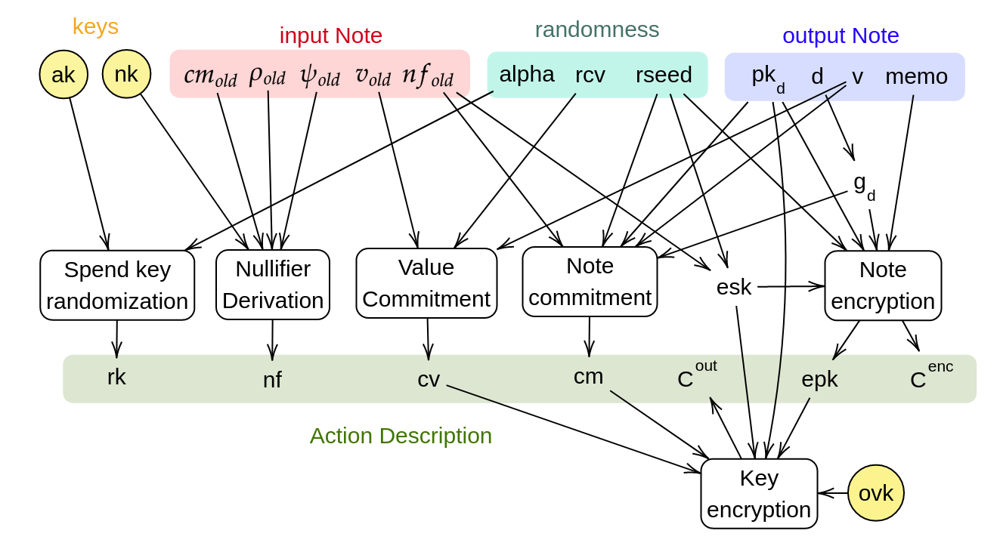

## Security model

  

Our communication scheme consists of four players: an user, a hardware wallet (HWW), a host (typically a desktop or a cell phone) and Zcash fullnode (a server maintaining a full blockchain copy).

Threat model for communication between host and fullnode is described in [Zcash doc](https://zcash.readthedocs.io/en/latest/rtd_pages/wallet_threat_model.html). In this section we focus only to the communication between the host, the user and the HWW.

Our security goal:

**User has complete control over the effect of his transactions.**

I.e. for every user's transaction, transaction fee and transaction's outputs (address, value, memo) cannot be tampered by a mallicious host.

Our privacy limitations:

**A host has viewing access to user's account.**

Every shielded transaction is authorized by a zero knowledge proof. Since compution of this proof is computationally demanding, this task must be delaged to the host. To do so, Full Viewing Key (FVK), which guarantees full access to the user's transaction history, must be revealed to the host. There no way how HWW can prevent a malicious host from sharing FVK with an attacker.

(Even if a mallicious host were locked into some sandbox without access to any side-channel, it can send FVK to an attacker by secretly encoding it into a transaction itself by manipulating proof randomness.)

## Comparison with the Ledger

- We implement _Orchard_ shielded protocol, while Ledger implemented the _Sapling_ shielded protocol.
- We have no control over the proof randomness. (Ledger maybe wont too after the NU5.)
- We don't have to worry about memory optimizations so much.

## Efficiency and memory analysis

#### Field and Pallas
Orchard uses arithmetics in 255-bit finite fiald Fp. Crate `pasta_curves` contains very efficient `no_std`-compatible implementation of Fp and of Pallas elliptic curve. Crate uses standard speed-up techniques like Montgomery reductions and projective coordinates.

Squaring in Fp is optimized by large pre-computed tables. Crate also contains a (`no_std` compatible) table-less squaring implemented via Tonelli–Shanks' square-root algorithm[[1](https://eprint.iacr.org/2012/685.pdf)] for `p mod 16 = 1`. Squaring is necessary for hashing to the curve and unpacking compressed curve points.

Hashing to the Pallas is realized by simplified version of SWU algoritm. Since linear term of Pallas equation is zero, algoritm first hashes a messages to a isogenic curve (isoPallas) and then maps the result to the Pallas.

#### Algorithms efficiency
```python
# fiel_mul - one field multiplication
# blake - one blake2b digest

curve_add = 14 * field_mul
curve_double = 7 * field_mul
curve_mul = 254 * curve_double + 254 * curve_add = 5334 * field_mul
isogeny = 33 * field_mul

field_sqrt = 822 * field_mul
hash_to_field = 3 * blake
map_to_curve = 19 * field_mul + 2 * field_sqrt = 1663 * field_mul
hash_to_curve = hash_to_field + 2 * map_to_curve + isogeny + curve_add = 3 * blake + 3373 * field_mul

sinsemilla_block = hash_to_curve + 2 * curve_add
commit_ivk = 51 * sinsemilla_block + curve_mul + curve_add
commit_note = 109 * sinsemilla_block + curve_mul + curve_add
reddsa_sign = 2 * blake + field_mul + 2 * curve_mul
```

TODO: ZIP-32
TODO: Address generation


## Trezor <-> Host interation

Transaction is authorized by zero-knowledge proof. We delegate computation of this proof to the host. We considered several models of interaction between HWW and the prover algorithm. They differ in the way how shielding randomness (transaction blinding factors) were created.

#### Randomness by Trezor

This is excluded, because all Trezor responses must be deterministic.

#### Randomness by Host

In this model all randomness is computed by the Host. Trezor just verifies effect of the transaction. I.e. Trezor gets a serialized shielded Orchard bundle and it decrypts its effect.

This approach has several issues:

1. Dummy outputs are not decryptable by default. It follows that Trezor cannot check these outputs. This could be solved by attaching Incoming Vieving Key to every output dummy Note.
2. Recipent address of an output cannot be recovered from Orchard Bundle data due to the nature of Unified Addresses. The Bundle contains only information about the Orchard receiver of the unified address. The recipient address cannot be recovered without knowledge of other receivers of the address. This could be solved by attaching original plaintext address to every output.
3. Trezor cannot check genuinity of Bundle shielding randomness.
Pros:
- Nullifiers dont have to be recomputed.

#### Randomness derived from a seed

In this model all randomness is derived from some random seed. Both parties, Trezor and the host, use this seed to shield the bundle, getting the same result. This approach is quite efficient for the Trezor, because it does not require Trezor to request nor store so much data.

I chose this approach.

### Randomness derivation from a seed

(this section has a documentation character and can be skipped)

The main seed - _bundle shielding seed_ - is derived as follows:
```python
ss_slip21 = keychain.derive_slip21(
    [b"Zcash Orchard", b"bundle_shielding_seed"],
).key()
bundle_shielding_seed = blake2b(
    b"TrezorShieldSeed",
    outlen=32,
    header_digest ||
        transparent_digest ||
        message_accumulator_state ||
        orchard_anchor ||
        ss_slip21,
)
```
For each action
```python
action_shielding_seed = blake2b(
    b"ActionShieldSeed",
    outlen=32,
    bundle_shielding_seed || i.to_bytes(4, "little"),
)
```
Blinding factors for Action shielding are derived as follows:
```python
random(dst, outlen) = blake2b(b"ActionExpandSeed", outlen,  action_shielding_seed + dst)
alpha = to_scalar(random(b"alpha", 64))
rcv = to_scalar(random(b"rcv", 64))

dummy_address = (
    random(b"dummy_d", 11),
    to_scalar(random(b"dummy_ivk", 64))
)
ock = random(b"dummy_ock", 32)
op = random(b"dummy_op", 64)
rseed_old = random(b"dummy_rseed_old", 32)
rseed_new = random(b"rseed_new", 32)
dummy_sk = random(b"dummy_sk", 32)
rho = to_base(random(b"dummy_rho"))
spend_auth_T = random(b"spend_auth_T", 32)
```

Permutation derivation is is little bit more complicated. We use personalized blake2b in counter mode to generate a stream of randomness. This stream is chunkized into block of 4 bytes and interpreted as a sequence of little-endinan unsigned integers. These integers are used to sample uniformly random integers necessary for Fisher-Yates algorithm.

```python
personal = b"Inps_Permutation"  # for inputs permutation
         | b"Outs_Permutation"  # for outputs permutation

block(i) = blake2b(personal, outlen=64, bundle_shielding_seed || i.to_bytes(4, "little"))
byte_stream = block(0) || block(1) || block(2) + ...
u32(i) = int.from_bytes(byte_stream[4*i : 4*(i+1)], "little")
u32_stream = [u32(0), u32(1), u32(2), ... ]

MAX = 0xFFFF_FFFF

sample_uniform(n, gen) = do
    while True:
        wide = next(gen) * n
        high = wide >> 32
        low = wide & MAX
        if low <= MAX - n or low <= MAX - (MAX - n) % n:
            return high

shuffle(x) = do
    gen = u32_stream
    for i in range(len(x) - 1, 0, -1):
        j = sample_uniform(i + 1, gen)
        x[i], x[j] = x[j], x[i]
```

## Sign transaction flow

In this section I will describe how a shielded transaction is signed. This process can be separated into three phases.

1. confirm transaction
2. shield transaction and compute its sighash
3. retrieve signatures

In the first phase, transaction details are requested by Trezor. All transaction inputs and outputs (both transparent and shielded) are requested by Trezor, one by one. Trezor requires user to confirm transaction outputs and fee. At the same time it incrementally updates digest of all received data to authentize them in phase 2.

Transaction sighash is computed in the second phase. From now, let call different parts of the transaction _bundles_. For sighash of the transparent bundle, hash components
```
prevouts_digest, amounts_digest, scriptpubkeys_digest, sequence_digest and outputs_digest
```
were already computed in the first phase. On contrary, Orchard bundle sighash components  
```
commitments_digest, memos_digest, notes_digest
```
must be computed now. This requires following steps:

1. Trezor derives a _bundle shielding seed_, from which all the randomness necessary for bundle shielding is derived. Trezor send this seed to the Host.
1. Since result of Orchard bundle shielding is completely determined by the set of Orchard inputs and outputs, anchor, flags and _bundle shielding seed_, the Host can replicate all following steps (3-8) to get the Orchard bundle. While Trezor is computing the bundle shielding to get its sighash, Host can compute a bundle authorizing proof in parallel.
1. Trezor makes the set of shielded inputs equal in size to the set of shielded outputs by padding the smaller one with dummy notes.
1. Trezor shuffles shielded inputs and output and zip them into Actions.
1. Trezor precomputes the Full Viewing Key for the account from which is being spent.
1. Trezor start incremental computation of the Orchard bundle sighash. For each action:
    1. Trezor request the action input (if it is not dummy).
    1. Trezor request the action output (if it is not dummy).
    1. Trezor derives _action shielding seed_ from the _bundle shielding seed_ and Action index.
    1. Trezor shields the Action and updates sighasher state by action components.
1. Trezor finishes the computation of Orchard bundle sighash by adding _anchor_, _value balance_ and _flags_ to the hash state.

There two reasons, why components of Orchard bundle are not computed already in the first phase.
1. Since Orchard bundle shielding is computationally demanding, this would cause (approx. 12s) delays between confirmations of individual shielded outputs.
2. We want to let the user to confirm transaction outputs in the same order he entered them on the Host and then compute sighash on shuffled outputs.



Shielding one Action (step 6.iv.) consists of:
- derivation of all necessary randomness computed from the _action shielding seed_
- derivation of the dummy input or output
- computation of input note nullifier
- randomization of spend validating key
- computation of output note commitmnet
- computation of the value commitment
- encryption of the note plaintext
- encryption of the outgoing note plaintext



### Message accumulator

Whenever Trezor re-requests some part of a transaction, it must check response integrity with the response it got the fist time.

In case of transaparent input (resp. outputs), this is easy. Trezor always iterates the sequence of inputs in the same order. Thus Trezor just always compute a digest of the sequence (which can be computed incrementally) and compares it with the first digest it got.

In case of shielded inputs (resp. outputs), this is more complicated, because orders of these are shuffled before shielding. Fortunetly, we can exploit parallelizability of HMAC to overcome this issue. Messages digest is computed as follows

```python
# derive a secret key
key = keychain.derive_slip21(
    [b"Zcash Orchard", b"Message Accumulator"],
).key()

# derive an unique mask for every message type and message index
mask_preimage[i][j] = i.to_bytes(2, "big") || j.to_bytes(4, "little") || 26*[0]
mask[i][j] = aes(key).encode(mask_preimage[i][j])

# initialize accumulator with zeros
initial_accumulator_state = 32 * [0]

# update the accumulator in an arbitrary order
update_accumulator(msg, msg_index, state) = do
    msg_digest = sha256(protobuf.dump_message_buffer(msg)).digest()
    msg_mask = mask[msg.code][msg_index]
    state = state xor aes(key).encode(msg_mask xor msg_digest)
```

Probably, just a xor of hmacs of tuples (message, index) would be secure too. The scheme above follows HMAC construction, which is **provably** secure. Construction differs in these points:
1. Original scheme uses the Galois counter for mask derivation to increase scheme efficiency. We want to avoid any incremental computation (and Galois counter implementation). The only requirement on input mask is uniformity and unpredictability. This is achived by encrypting tuples `(message_type, messsage_index)` by AES.
2. We ommit the last step of the HMAC construction, where xor sum is encrypted, because this sum never leaves the Trezor.

## External Zcash crates

All Zcash crypto libraries are available in Rust. I wanted to use them directly as dependencies, but I run into many issues, so I ended up with using only `pasta_curves` crate.

| library | alloc  | no_std | used | issue |
| -       | -      | -      | -    | -     |
| [pasta_curves](https://github.com/zcash/pasta_curves)                              | :heavy_check_mark: | :heavy_check_mark: | :heavy_check_mark: | used , but alloc-indepentdent `hash_to_curve` function is missing |
| [f4jumble](https://github.com/zcash/librustzcash/components/f4jumble)              | :heavy_check_mark: | :heavy_check_mark: | :x: | was fine, but replaced by 40 lines of python code |
| [zcash_note_encryption](https://github.com/zcash/librustzcash/components/f4jumble) | :heavy_check_mark: | :heavy_check_mark: | :x: | usable only through `orchard` crate |
| [orchard](https://github.com/zcash/orchard)                                        | :x:                | :x:                | :x: | Only some functionalities from orchard crate are needed. The crate itself is quite complex, so I doesn't worth to try divide it into necessary and unnecessary part. |
| [reddsa](https://github.com/str4d/redjubjub)                                       | :heavy_check_mark: | :heavy_check_mark: | :x: | Works nicely, but can by replaced by 15 python lines and does not support deterministic randomness, which we need. |
| [fpe](https://github.com/str4d/fpe)                                                | :heavy_check_mark: | :x: | :x: | inefficient, heavy, depends on `big-num` crate, which is also quite heavy and alloc-dependant |
| [sinsemilla]()                                                                     | :heavy_check_mark: | :x:                | :x: | Requires 64kb of precomputed data to be stored. |
| [poseidon]()                                                                       | :heavy_check_mark: | :x:                | :x: | Too heavy. `Spec::constants` method is memory inefficient and alloc-dependant and it's hard to redesign it. |
