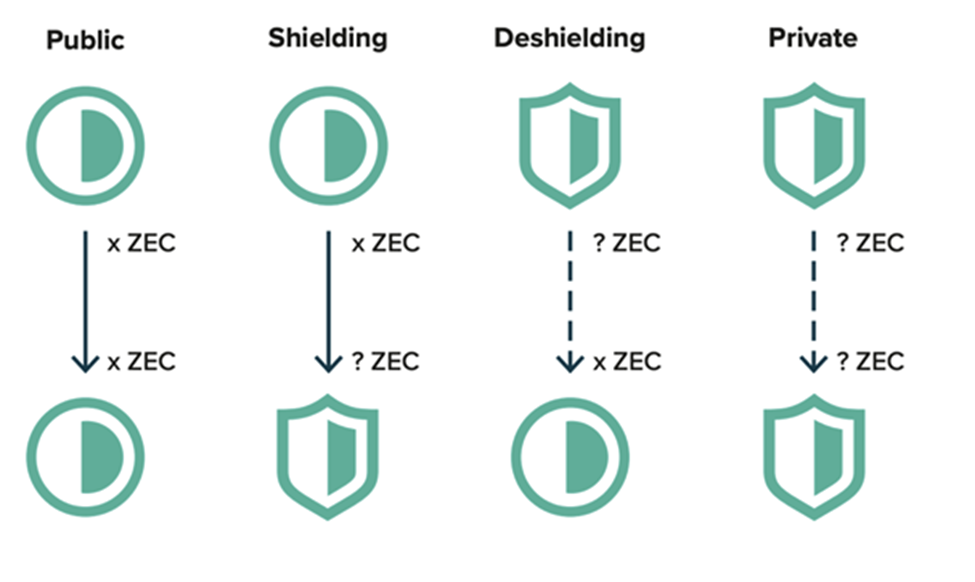
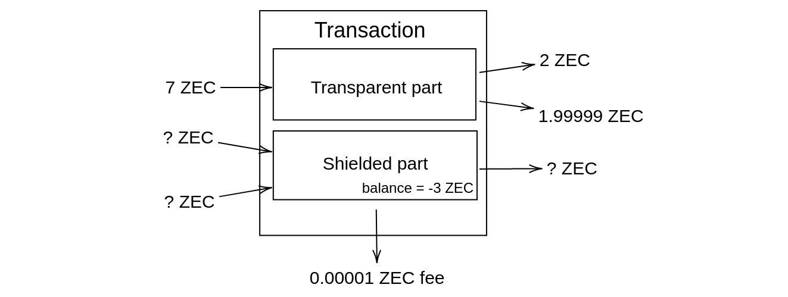
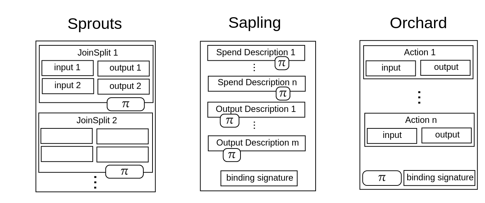
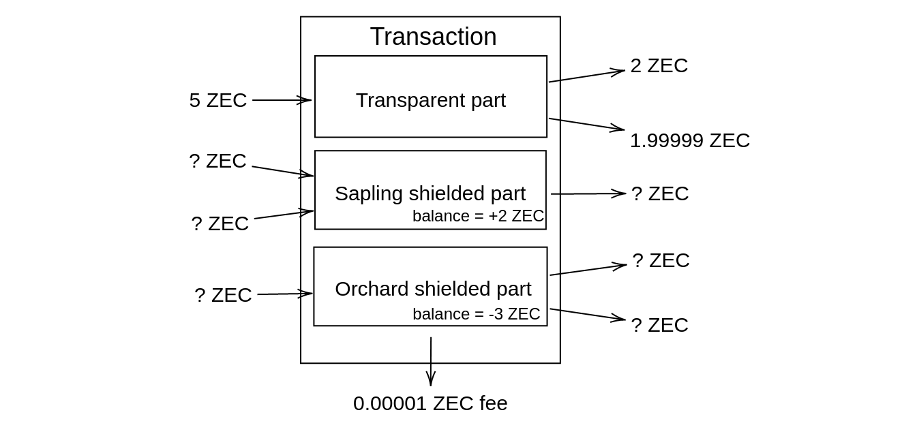
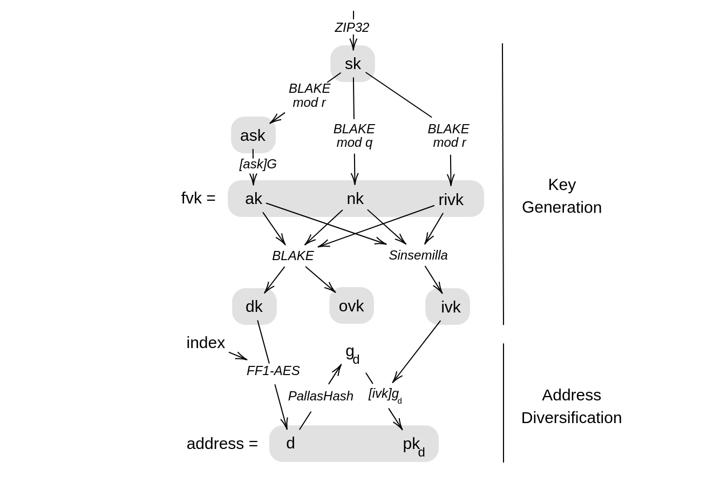
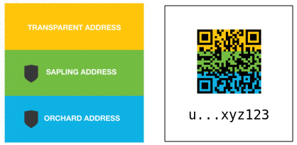

# Zcash analysis

- [Shielded transactions](#shielded-transactions)
- [Pallas and Vesta curves](#pallas-and-vesta-curves)
- [ZIP32](#zip32)
- [Key components](#key-components)
- [Unified addresses](#unified-addresses)
- [Spending (input) notes](#spending-input-notes)
- [Sending (output) notes](#sending-output-notes)
- [Orchard Actions](#orchard-actions)
- [Transaction authorization](#transaction-authorization)
- [Blockchain scanning](#blockchain-scanning)
- [Transaction fields](#transaction-fields) and
- [Action description fields](#action-description-fields)


### Notation

I use `inline code font` for names of types and variables. I write `type[n]` for an array of type `type` and length `n`. I write only `type[]`, if the length of the array is obvious from the context.

I ilustrate some schemes with pseudocode, where `:=` denotes a definition, `||` denotes concatenation and `[x]G` denotes multiplication of point `G` by scalar `x`.

## Shielded transactions  

Zcash is designed as an extension of bitcoin, however it is an independent cryptocurrency. It enables to hide a transaction graph to enhance the user's privacy.  

There are two types of Zcash addresses: _transparent_ and _shielded_. Transparent addresses are equivalent to Bitcoin addresses. For a shielded address, nobody (except its owner) can see the address balance, incoming and outcoming payments. These two types of addresses are compatible, hence it is possible to send shielded funds to a transparent address and vice versa. It is also possible to send fully shielded transactions from one shielded address to another, as illustrated below.  

  

_image source: `https://www.veradiverdict.com/p/snapchat-for-payments`_  

In fact, a transaction can be even more mixed, having multiple transparent inputs and outputs and multiple shielded inputs and outputs, as illustrated below.  

  

Transaction creator proves the integrity of the shielded transaction (tx balance, spend authorization, no double spending...) by attaching a zero knowledge proof.  

There are three consecutive versions of Zcash shielded protocol: Sprouts, Sapling and Orchard.  

- Sprouts (2016) is the first naive clumsy implementation of shielded transactions.  

- Sapling (2018) integrated many circuit optimizations using algebraic hash functions over the JubJub curve. Further it brought major restructuralizations of key components and shielded data.

- Orchard (2021) introduced a recursive Halo2 zk-proving protocol and several additional circuit and structural changes.  



_transaction structure for different shielded protocols_

Each of these protocols has its own privacy pool, e.i. privacy set of all funds currently shielded by the protocol. The more funds were shielded by the protocol, the higher level of privacy pool reaches.  

Since Sprouts depreciation is scheduled (2022), users are forced to migrate their shielded funds into Sapling pool. Otherwise they will lose them irrevocably.

Multiple shielded protocols can be used within one transaction as illustrated below.



Through this document, I consider a transaction that contains only transparent inputs and outputs and Orchard shielded inputs and outputs. Hence I minimize usage of _Orchard_ prefix. For example by _binding signature_ I mean _Orchard binding signature_, not _Sapling binding signature_.

## Pallas and Vesta curves

Orchard uses a pair of elliptic curves _Pasta_ and _Vesta_. These Weierstrass curves defined by equation

```
y^2 = x^3 + 5
```

and two constants:

```python
q = 0x40000000000000000000000000000000224698fc094cf91b992d30ed00000001
r = 0x40000000000000000000000000000000224698fc0994a8dd8c46eb2100000001
```

Integer `q` is the size of the base field of Pallas and scalar field of Vesta. Integer `r` is the size of the base field of Vesta and scalar field of Pallas.

These two curves were designed by Zcash cryptographers. They are documented on [github](https://github.com/zcash/pasta). All Orchard's cryptography runs over the Pallas curve. Vesta is used only during a proof computation.

## ZIP32  

Paths of Orchard keys are of type  

```  
m_orchard/purpose'/coin_type'/account'  
```  

where  

- `purpose` is set to `32'` following the BIP 43 recommendation.  
- `coin_type` is set to `133'` following the SLIP 44 recommendation.  
- `account` is numbered from index 0 in sequentially increasing manner.  

Each account is further split into _external_ (addresses for receiving paymets) and _internal_ (e.g. change addresses). Spending authority is shared among external and internal addresses while viewing keys are individual for each.

> Unlike BIP 44, none of the shielded key paths have a `change` path level. The use of change addresses in Bitcoin is a (failed) attempt to increase the difficulty of tracking users on the transaction graph, by segregating external and internal address usage. Shielded addresses are never publicly visible in transactions, which means that sending change back to the originating address is indistinguishable from using a change address.
> cited from [ZIP-32](https://zips.z.cash/zip-0032#key-path-levels)

Finally, every account has 2^88 available diversified payment addresses belonging to the same spending authority. _Default payment address_ is indexed by 0.

For a `secret` seed, Orchard master key and master chaincode is generated as follows.  

```python
I := Blake2b_512(b"ZcashIP32Orchard", secret)  
sk_m, c_m := I[0:32], I[32:64]   
```  

Given a pair of secret key `sk` and a chain code `c`, `i`-th Orchard child key is generated as follows:  

```python  
assert i < 2**31
i_bytes := i.to_bytes(length=4, endian="little")
I := Blake2b_512(b"Zcash_ExpandSeed", c || [0x81] || sk || i_bytes)  
sk_i, c_i := I[0:32],I[32:64]   
```  

## Key components  

_Spending key_ `sk` is used as a seed for generating Orchard key components. The table bellow is an exhaustive list of Orchard key components.

| Symbol | Name                          | Comment |  
|--------|-------------------------------|--------------------------------------------------|  
| `ask`  | spend authorizing key         | Enables to spend funds from the address. Never leaves the Trezor.  |  
| `ak`   | spend validating key          | public key for `ask`  |  
| `nk`   | nullifier deriving key        | |  
| `rivk` |                               | some between-product randomness |  
| `fvk`  | full viewing key              | is the triple `(ak,nk,rivk)` | Enables to prove transaction correctness and to derive other keys. Leaves the Trezor.  |  
| `ivk`  | incoming viewing key          | Enables to detect and decrypt all incoming Notes.  |  
| `ovk`  | outgoing viewing key          | Enables to decrypt Notes sent from this account. This feature is optional, but force-enabled in Trezor. |  
| `dk`   | diversifier deriving key      | Enables do derive diversifiers.  |  
| `d`    | address diversifier           | |  
| `pk_d` | diversified transmission key  | |  
| `addr` | diversified payment address    | is the pair `(d,pk_d)`  |  

Components are derived hierarchically as illustrated bellow.

  

The diagram above corresponds to the following definitions:

```python  
PRF(sk, m) := Blake2b_512(b"Zcash_ExpandSeed", sk || m)  

ask  := PRF(sk, [0x06]) mod r  

ak   := [ask]G # G is a Pallas generator  
nk   := PRF(sk, [0x07]) mod q  
rivk := PRF(sk, [0x08]) mod r  

fvk  := (ak,nk,rivk)  

ivk  := sinsemilla_commit(rivk, ak, nk)  

I    := PRF(rivk, [0x82] || ak || nk)   
dk   := I[ 0:32]  
ovk  := I[32:64]  


gen_diversified_address(j, dk, ivk) := do  
    j_bytes := int_to_bytes(j, byte_length=11, signed=False)  
    d       := FF1_AES_256.encrypt(dk_i, b"", j_bytes)  
    G_d     := hash_to_curve(d)  
    pk_d    := [ivk]G_d  
    return (d,pk_d)  
```   

where

- Function `sinsemilla_commit` is a basically Pedersen commitment optimized for Halo2 proof system.
- Function `hash_to_curve` is a constant-time hashing to Pallas curve based on Balke2b and  elliptic curve isogenies.
- Integer `r` is the Pallas scalar field and integer `q` is the Pallas base field.

  

## Unified addresses



Unified addresses (UAs) are one of NU5 features. They enable a user to share his transparent and shielded payment addresses in one standardized bundle. UAs are well described in [ZIP 316](https://github.com/zcash/zips/blob/main/zip-0316.rst).

Although UAs are not an indispensable feature, we want to support them and they are part of the grant description.

> We'd also be up for strong marketing in support of Trezor supporting Unified Addresses out of the gate.

_source: @Josh, 13.5.2021, #ecc-trezor slack channel_

In a shortcut:

```python
ua_bytes := address_1 || ... || address_n
address  := compatSize(typecode) || compatSize(length) || key
# length := byte length of a key
typecode := 0x03 # for Orchard
            0x02 # for Sapling
            0x01 # for transparent P2SH
            0x00 # for transparent P2PKH

hrp := "u"     # for mainnet
       "utest" # for testnet
padding := hrp || [0x00]*(16 - len(hrp))
ua_encoded := F4Jumble(ua_bytes || padding)
unified_address := hrp || Bech32m(ua_encoded)
```

where `F4Jumble` is an unkeyed 4-round Feistel construction to approximate a random permutation described in [ZIP 316](https://github.com/zcash/zips/blob/main/zip-0316.rst). This function makes it computationally impossible to generate two lexicographically close addresses. Therefore it should be sufficient to check only first 16 bytes when spending to UA (**not confirmed, just my reasoning**).

UA's components are ordered by priority according to this priority list:

1. Orchard
2. Sapling
3. transparent (P2SH and P2PKH)

Each address type (Orchard, Sapling, transparent) may be included only once. Otherwise UA will be rejected. UA containing only a transparent address will be rejected.

TODO: autoshielding feature

TODO: UA requirements

## Sending (output) Notes  

In Zcash terminology, the user sends and receives _Notes_. To send a Note, user chooses Note's value `v`, Note's receiver address `addr` and (an optional) Note's arbitrary comment `memo`.  

To create and send a new Note, user shields the Note, using a randomness `rseed` and `rcv`, getting a tuple (`cm`, `cv`, `C_enc`, `C_out`, `epk`). This tuple is recorded to the blockchain.  

- `cm` - Note commitment  
- `cv` - value commitment  
- `C_enc` - Note encryption for a recipient  
- `C_out` - Note encryption for a sender (optional)  
- `epk` - ephemeral key for a Diffie-Helman key exchange  

All these components must be computed in Trezor. It is the simplest way how Trezor can validate integrity and randomizations of all these components.

## Spending (input) Notes  

When user is spending a Note, the only information related to the Note he must reveal within a shielded transaction is the Note's _nullifier_ `nf_new`, computed from the input Note's data `(cm, rseed, nf_old)` and user's nullifier key `nk`.

Nullifier serves as the serial number of a Note. Once the nullifier is revealed within a valid transaction, Note is spent and any other transaction attempting to spend with the same nullifier will be refused.

Without knowledge of the nullifier key `nk`, nullifier is not linkable to its Note. Hence nobody (including a Note sender), given a nullifier, can distinguish which Note was spent.  

Next, a random Pallas scalar `alpha` is generated (in the Trezor). `alpha` is then used to randomize spend validating key `ak`. This randomized spend validating key (called `rk`) is part of an _Action_ description.

```python
rk := [alpha]G + ak
```

## Orchard Actions  


Before sending a shielded Orchard transaction, a sender must pair input Notes with output Notes. Such a pair is called an _Action_.  

Both, set of input Notes and set output Notes, can be padded by _Dummy Notes_, to make these sets equal in size. A Dummy Note is a Note with zero value, no recipient and no connection to previously committed Notes. However Dummy Note is completely indistinguishable from other Notes after the shielding procedure.  

> In order to minimize information leakage, the sender SHOULD randomize the order of Action descriptions in a transaction. Other considerations relating to information leakage from the structure of transactions are beyond the scope of this specification.

_source: NU5 doc § 4.7.3_

## Transaction authorization  

Shielded part of a transaction is authorized by  

1. `spendAuthSig[]` - _spend authorization signatures_  
2. `bindingSig` - _binding signature_  
3. `proof` - zero-knowledge proof of the transaction integrity  

### Spend authorization signatures  

For each input Note, rerandomized spend validating key `ak` (called `rk`) is a part of an Action description. A signature `spendAuthSig` of transaction's `SIGHASH` made by corresponding randomized spend authorizing key `ask` is computed to authorize a spend. Since `ask` never leaves the Trezor, user's ZEC funds cannot be spent without confirmation on Trezor.  

### Binding signature  

The binding signature proves the balance of the shielded part of a transaction (i.e. all shielded inputs minus all shielded outputs = `v_net`). It uses the homomorphic additivity of Pederson's commitments used for value commitments `cv[]`. The same technique is used in Monero, or MimbleWimble protocol.

### Proof  

Integrity of a shielded transaction is proven by zk-SNARK (zero-knowledge Succinct Non-interactive ARgument of Knowledge). Zcash Orchard uses a proof system called _Halo 2_. Since the proof generation is computationally demanding, it is delegated to the Host.  

Prover needs merkle tree paths of Notes spent by transaction to prove: "This Note is committed somewhere in the blockchain.". A root `rt` of the merkle tree of every Note commitment in the blockchain is fixed and attached to a transaction as a reference for this statement. The root can be computed from any previous state of the blockchain. However, the fresher the root taken, the bigger is the privacy set.  

**Since the proof is not a part of transaction signed fields, Trezor has no control over the proof randomness.** It follows that the Host can manipulate randomness of the proof arbitrarily, for example to encode some information into the proof. In our model, a malicious Host can violate all privacy features of the protocol. Nevertheless, this vulnerability enables the Host to leak information directly through the main channel (e.i. by recording a transaction with a rigged proof onto blockchain), instead of communicating data through a side channel.

We don't consider this issue to be important. Backward proof randomness checking could be implemented to detect such Host's mal-behaviour, but it would be technically demanding and it would require circuit modifications.

## Blockchain scanning  

To detect incoming Notes, a Host must try to decrypt every new shielded Note in the blockchain using incoming viewing key `ivk`. Notes are encrypted by `AEAD_CHACHA20_POLY1305`, which returns integrity error for inappropriate keys. You can find illustrative python pseudocode bellow.   

```python  
note_trial_decryption(C_enc, epk) := do   
        shared_key   := [ivk]epk  
        KDF_input    := shared_key || epk  
        symetric_key := Blake2b_256("Zcash_OrchardKDF", KDF_input)  
        return AEAD_CHACHA20_POLY1305(symetric_key).decrypt(C_enc)  
```  

Further, all detected incoming Notes and their merkle tree paths should be stored in the Host. The Host should not store only indexes of incoming transactions, because querying some blocks more than others reveals information about the user's transactions to the fullnode.

The optimal approach would be to use Zcash light client, which uses some optimizations and batching techniques to reach maximal efficiency.

## Transaction fields

source: [ZIP 225](https://zips.z.cash/zip-0225)

| Bytes | Name | Data Type | Description|  
|---|-----------------|--------|--------------------------------------------------------------|  
| 4 | `header`          | uint32 |                                                              |  
| 4 | `nVersionGroupId` | uint32 | Version group ID (nonzero).                                  |  
| 4 | `nConsensusBranchId` | uint32 | Consensus branch ID (nonzero). |  
| 4 | `lock_time`       | uint32 | Unix-epoch UTC time or block height, encoded as in Bitcoin.  |  
| 4 | `nExpiryHeight`   | uint32 | A block height in the range (1...499999999) after which the transaction will expire, or 0 to disable expiry. [ZIP-203] |  
|   |                   |        |                                                              |  
| varies | `tx_in_count`  | compactSize | Number of transparent inputs.               |  
| varies | `tx_in`        | tx_in       | Transparent inputs, encoded as in Bitcoin.  |  
| varies | `tx_out_count` | compactSize | Number of transparent outputs.              |  
| varies | `tx_out`       | tx_out      | Transparent outputs, encoded as in Bitcoin. |  
|        |                |             |                                             |  
| 1   | `nSpendsSapling`  | compactSize | The number of Sapling Spend descriptions.  |  
| 1   | `nOutputsSapling` | compactSize | The number of Sapling Output descriptions. |  
| ... | ...               | ...         | Sapling staff skipped.             |   
|     |                   |             |                                    |  
| varies                | `nActionsOrchard`       | compactSize               | The number of Action descriptions `n`.  |  
| 884·`n`               | `vActionsOrchard`       | ActionDescription[`n`]     | A sequence of Action descriptions, as described bellow. |  
| 1                     | `flagsOrchard`          | byte                      | Orchard flags described bellow.   |  
| 8                     | `valueBalanceOrchard`   | int64                     | The net value of Orchard spends minus outputs.  |  
| 32                    | `anchorOrchard`         | byte[32]                  | A root of the Orchard note commitment tree at some block height in the past.  |  
| varies                | `sizeProofsOrchard`     | compactSize               | The length of the aggregated  zk-SNARK proof. |   
| `sizeProofsOrchard`   | `proofsOrchard`         | byte[`sizeProofsOrchard`]   | The aggregated zk-SNARK proof. |  
|64·`n`                 | `vSpendAuthSigsOrchard` | byte[64][`n`]             | Authorizing signatures for each spend of an Orchard Action description.  |  
|64                     | `bindingSigOrchard`     | byte[64]                  | An Orchard binding signature on the SIGHASH transaction hash. |  


Flags:  
- `enableSpendsOrchard` flag (bit 0)  
- `enableOutputsOrchard` flag (bit 1)
- Reserved, zeros (bits 2 .. 7)  

We set `nSpendsSapling` and `nOutputsSapling` to 0.

We set `enableSpendsOrchard` and `enableOutputsOrchard` to 1.

## Action description fields  

source: [ZIP 225](https://zips.z.cash/zip-0225)  

|  Bytes | Name            | Description |  
|--------|-----------------|-------------|  
|    32  | `cv`            | A value commitment to the net value of the input note minus the output note. |  
|    32  | `nullifier `    | The nullifier of the input note `nf`. |  
|    32  | `rk `           | The randomized validating key for `spendAuthSig`. |  
|    32  | `cmx  `         | The x-coordinate of the note commitment for the output note. |  
|    32  | `ephemeralKey`  | Encoding of an ephemeral Pallas public key `epk`. |  
|    580 | `encCiphertext` | A ciphertext component for the encrypted output note `C_enc` |  
|    80  | `outCiphertext` | A ciphertext component `C_out`, that enables the sender to recover the receiver's payment address and note plaintext.|  
